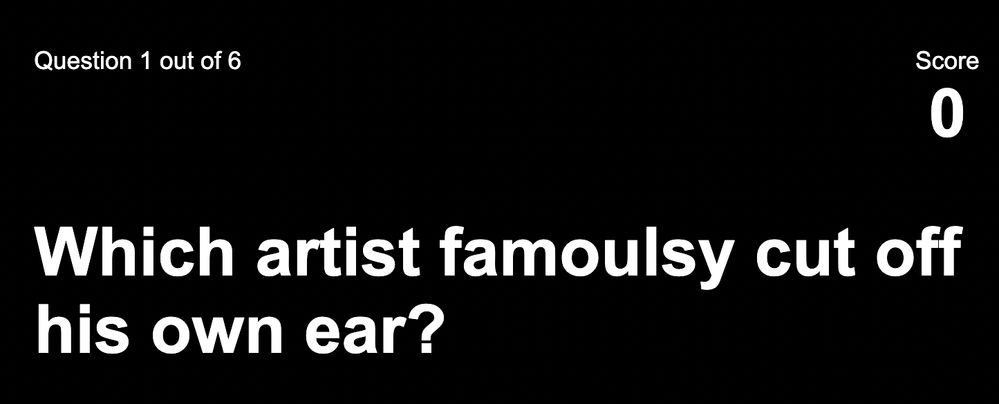

# General Knowledge Quiz #

My project, the General knowledge Quiz, was created to enable users to quiz themselves on random topics. The focus is a smooth user experience, that is enjoyable and enables users to gain knowledge in the process.

 
# Features #

## Play Now page ##

Play now button with a Ready to Play header

## Question section ##

A clear display of each question, the ability to see which question you are on and the score 

## Answers ##

The options are highlighted and increase in size when hovered over, and go either green or red depending on whether the answer is correct or not 

## End page ##

This calculates the total points the user has accumulated and gives them the choice to play again

# Testing #
All features well as intended 

No unfixed bugs

## Validator Testing ##

HTML - No errors were returned when passing through the official W3C validator
CSS - No errors were found when passing through the official (Jigsaw) validator
JavaScript - No errors were found when passing through the official Jshint validator

# Deployment #

This project was deployed using GitHub

The live link can be found here - https://sabrinatam.github.io/generalknowledgequiz/ 

# Credits #

The Love Maths tutorial

https://stackoverflow.com/questions/59206813/how-can-i-pass-this-javascript-code-to-typescript-its-from-a-trivia-api - to assist with my Javascript
